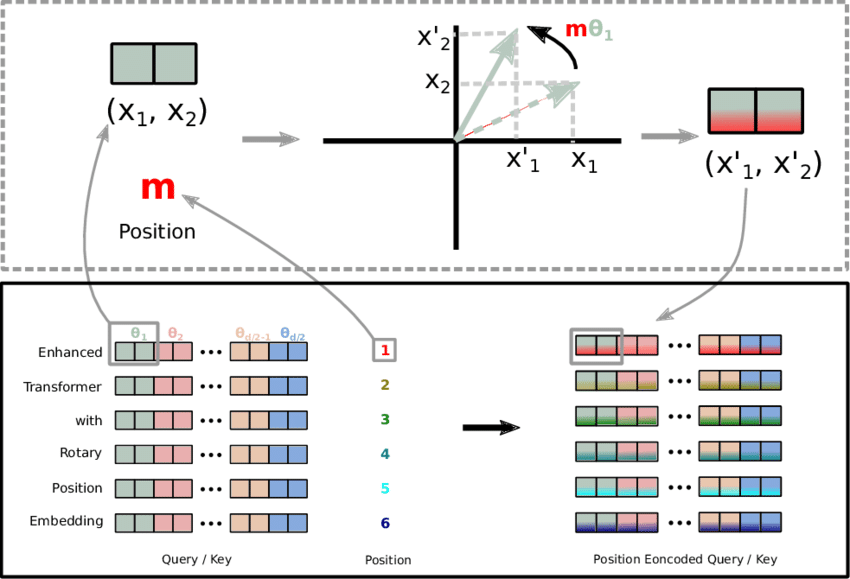

# Transformer 2
Radi Akbar <br>
Personal Project

## Introduction
The world of NLP is developing at a rapid space. There has been so many updates to the original Transformer architecture, that its hard keeping track of all the progress that happened. This project showcases some of the recent developments in the Transformer architecture through tweaking the sequence-to-sequence model and compare its performance on English to German machine translation task.
<p align="center">
  
</p>

## Training Specifications
### Architecture
The architecture of the model remains the same from the original [[1]](#1) but with a few modifications. First update is replacing the Additional Positional Embedding (APE) with Rotary Positional Embedding (ROPE) [[4]](#4). ROPE rotates the embedded sequences to inject positional information instead of adding it. It's been shown that ROPE can hold long-term dependency between words in huge context windows. <br>

<p align="center">
  
</p>

The second update is replacing LayerNorm with RMSNorm [[2]](#2). LayerNorm addresses the problem of covariance shifts during training by standardizing the inputs by its mean and standard deviation. RMSNorm simplifies the normalization process by only dividing the input by its standard deviation. <br>

**RMS Norm Equation**
$$\bar{a_i}=\frac{a_i}{RMS(a)}g_i, \text{where } RMS(a) = \sqrt{\frac{1}{n}\sum_{i=1}^{n}a_i^{2}}.$$

The third update is replacing the ReLU activation function with SwiGLU [[3]](#3). It's been shown that SwiGLU improves the performance of NLP tasks. The paper also specifies that to make computation less expensive, they change the hidden size of the MLP component by multiplying it with 2/3.

**SwiGLU**
$$SwiGLU(x, W, V, b, c, \beta) = Swish_{\beta}(xW + b) \otimes (xV + c)$$

### Training Setup
I follow the original paper's training setup by using an Adam optimizer with $\beta_1 = 0.9, \beta_2 = 0.98$ and their learning rate schedule. One tweak I made was adjusting the number of warmup steps to the GPU compute available to me. <br>

The original paper and most LLM papers train on huge batch sizes, but due to resource limitations I use a batch size of 16. To address this problem, I used gradient accumulation so that the model only update its gradient every 32 step to simulate a batch size of 512. <br> 

According to this [Medium Article](https://medium.com/@martin.p.dittgen/reproducing-the-attention-is-all-you-need-paper-from-scratch-d2fb40bb25d4), the original paper trains the model on 16 epochs with a batch size of 724. Since there's roughly 4.7m rows in the training dataset, that means it ran through approximately 6.2k steps per epoch and totaling to 100k steps. From these facts, I interpolate that my training would run for approximately 150k steps in total and that my warming up steps is 6k. 

## Usage
### Tokenizer Preparation
To prepare the tokenizer, I train a BPE tokenizer based on Huggingfaces' WMT14 German-English dataset. I made sure that the vocabulary size of the tokenizer is consistent with the one from the paper (roughly 37k tokens between German). I trained the tokenizer model and upload it to my Huggingface account. If you want to recreate the project, you can simply access the tokenizer by running the following line Python.

```
PreTrainedTokenizerFast.from_pretrained('radia/wmt14-de2en-tokenizer')
```

## Training the Model
For this experiment, I used a compute engine from Google Cloud with 1 Nvidia L4 GPU. To run the training script, use the following line:
```
torchrun --standalone --nproc-per-node=1 train.py
```
The training takes 3.5 days approximately.

## Performance Evaluation
For brevity, I used a greedy search method to generate translation results and use Huggingface's sacrebleu to score my results against the test data. To reproduce the results, run the `evaluate_model.py` script to get the model's BLEU score.

For German to English translation, the model has a BLEU score of 28.1, which is higher than the original transformer's 25.8 for the same model size.

# Conclusion
The SOTA methods for current LLM's improved the original transformer's performance by 2.3 points! However, much more work is needed to be done on studying parameters that would stabilize the model during training. As my gradients exploded and had to raise RMSNorm's $\epsilon$ parameter to stabilize it. In addition, future work needs to be done on scoring this model on various other tasks such as question and answering and etc. Alternatively, the model could follow Meta's BART pretraining configuration and fine-tune it for specific NLP tasks.

## References
<a id="1">[1]</a> 
Ashish Vaswani, Noam Shazeer, Niki Parmar, Jakob
Uszkoreit, Llion Jones, Aidan N Gomez, Ł ukasz
Kaiser, and Illia Polosukhin. 2017. Attention is all
you need.

<a id="2">[2]</a> 
Biao Zhang and Rico Sennrich. 2019. Root mean
square layer normalization.

<a id="3">[3]</a> 
Noam Shazeer. 2020. Glu variants improve transformer.

<a id="4">[4]</a> 
Jianlin Su, Yu Lu, Shengfeng Pan, Ahmed Murtadha,
Bo Wen, and Yunfeng Liu. 2021. Roformer: Enhanced transformer with rotary position embedding.

<a id="5">[5]</a> 
Zhengxiao Du, Yujie Qian, Xiao Liu, Ming Ding, Jiezhong Qiu, Zhilin Yang, and Jie Tang. 2021. GLM: General Language Model Pretraining with Autoregressive Blank Infilling.

<a id="6">[6]</a> 
Hugo Touvron, Thibaut Lavril, Gautier Izacard, Xavier Martinet, Marie-Anne Lachaux, Timothée Lacroix, Baptiste Rozière, Naman Goyal, Eric Hambro, Faisal Azhar, Aurelien Rodriguez, Armand Joulin, Edouard Grave, and Guillaume Lample. 2023. LLaMA: Open and Efficient Foundation Language Models.

<a id="7">[7]</a> 
Sid Black, Stella Biderman, Eric Hallahan, Quentin Anthony, Leo Gao, Laurence Golding, Horace He, Connor Leahy, Kyle McDonell, Jason Phang, Michael Pieler, USVSN Sai Prashanth, Shivanshu Purohit, Laria Reynolds, Jonathan Tow, Ben Wang, and Samuel Weinbach. 2022. GPT-NeoX-20B: An Open-Source Autoregressive Language Model.
